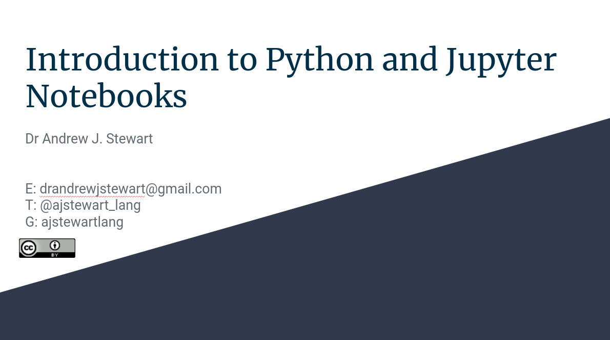

Installing Python with Conda 
============================

In this first workshop we will cover how to install Python (plus Jupyter notebooks) via the package manager Conda.

<iframe width="560" height="315" src="https://youtube.com/embed/HjF98JryayQ" frameborder="0" allowfullscreen></iframe>

&nbsp;

You can view and download the slides in a variety of formats by clicking on the image below.

    

