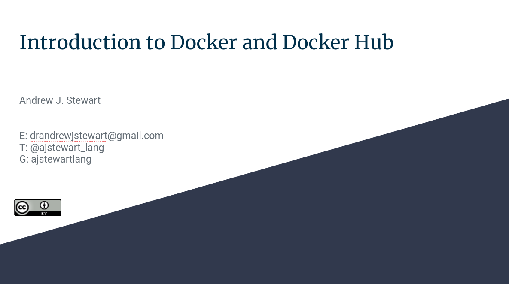

# Making your Analysis Reproducible

## Slides

You can view and download the slides in a variety of formats by clicking on the image below.

    

## Introduction to Docker
 
In the video below I introduce you to the concept of containerisation using Docker.
 

<iframe width="560" height="315" src="https://youtube.com/embed/xZB_lJTRfY4" frameborder="0" allowfullscreen></iframe>

There's also a good official introduction to Docker [here](https://docs.docker.com/get-started/).

## Docker on Windows

In the video below I take you through Docker on Windows. Using the Powershell I cover running Docker containers, linking Docker containers with your local directories and files, and writing Dockerfiles to build new Docker images. 

### Part One

<iframe width="560" height="315" src="https://youtube.com/embed/7O5B-jGbAxM" frameborder="0" allowfullscreen></iframe>

### Part Two

<iframe width="560" height="315" src="https://youtube.com/embed/RoWKtvNvFN8" frameborder="0" allowfullscreen></iframe>

## Docker on macOS

In the video below I take you through Docker on macOS. Using the Terminal I cover running Docker containers, linking Docker containers with your local directories and files, and writing Dockerfiles to build new Docker images. 

### Part One

<iframe width="560" height="315" src="https://youtube.com/embed/ZkBbBuOvnpo" frameborder="0" allowfullscreen></iframe>

### Part Two

<iframe width="560" height="315" src="https://youtube.com/embed/vvx37IgxbhU" frameborder="0" allowfullscreen></iframe>

